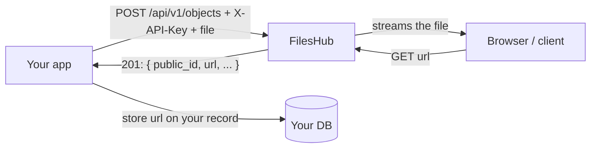

# Introduction

**FilesHub is a zero-cost file-storage, email, and developer-utility API: you upload a file over plain HTTP to `POST /api/v1/objects` with an `X-API-Key` header, and FilesHub stores it and returns a stable URL you can link to or download.** Around that storage core it adds object listing, deletion, per-file visibility, optional auto-expiry, scoped API keys, transactional email (send, templates, recurring schedules), and 50+ stateless utility endpoints — all under one base URL and one key.

FilesHub runs at [fileshub.zaions.com](https://fileshub.zaions.com) and is the upload backend used by every Aoneahsan/Zaions project, so an app never has to run its own storage server. It is built on Laravel + Nova and maintained by [Ahsan Mahmood](https://aoneahsan.com).

## What FilesHub does

| Capability | One-line summary |
|---|---|
| **Store a file** | `POST /api/v1/objects` with a multipart `file` → `201` with a `public_id` (ULID) and a ready-to-use `url`. |
| **Serve a file** | `GET /api/v1/objects/{public_id}` streams the file back with its real content type. Public files need no key. |
| **List files** | `GET /api/v1/objects` returns a paginated list of your project's objects. |
| **Delete a file** | `DELETE /api/v1/objects/{public_id}` removes the record and the stored bytes together. |
| **Control access** | Each object is `public` or `private`; keys carry `read`/`write` permissions and optional origin restrictions. |
| **Auto-expire** | `expires_in_days` or `expires_at` on upload makes a file self-clean after its window. |
| **Send email** | `POST /api/v1/emails/send` — raw or [template](api/emails-send), from a verified domain, queued with a job to poll. |
| **Ship a key in a frontend** | Mark a key [restricted](getting-started/api-key-restrictions) to your web origin or app (Android package + signing cert, iOS bundle id) — no proxy backend needed. |
| **More than storage** | 50+ utility endpoints (hashing, encoding, converters, QR codes, short URLs, OTP, vault, image/PDF). |

## Why it exists

Most apps need the same two things from a backend: somewhere to put a user's file, and a URL to show it again later. Standing up object storage, signing URLs, and wiring a CDN is disproportionate work for that. FilesHub collapses it to one HTTP call: send the bytes with a key, store the returned `url`, render it. The same deployment then doubles as a grab-bag of common developer utilities so small apps don't each re-implement hashing, QR generation, or short links.

## Common use cases

- **User avatars and uploads** — accept a profile photo or attachment in your web/mobile app, `POST` it to FilesHub, store the returned `url` on the user record, and render it directly in an ``.
- **Generated exports and reports** — write a CSV/PDF your app produced to FilesHub with `expires_in_days: 7`, hand the user a download link, and let the file clean itself up afterwards.
- **Share links** — store a public object and share its URL; anyone with the link can open it, no auth round-trip.
- **Private documents** — keep `visibility: private` and fetch the bytes server-side with a `read` key so the file is never exposed without your app in the loop.
- **Cross-project asset host** — one FilesHub deployment backs many small apps, each with its own scoped key, instead of one storage bucket per app.

## How a request flows

## Where to go next

- [Quick Start](getting-started/quick-start) — upload your first file in about five minutes with `curl` or `fetch`.
- [Authentication](getting-started/authentication) — how `X-API-Key`, key scopes, and restrictions work.
- [API key restrictions](getting-started/api-key-restrictions) — ship a key safely in a React or mobile frontend.
- [API Reference](api/overview) — every endpoint (objects, email, jobs) with exact request/response shapes.
- [OpenAPI spec](api/openapi) — a machine-readable `/openapi.json` and raw-Markdown mirror for AI coding agents.
- [Integrate from any app](guides/integrate-from-any-app) — copy-paste integration for JS/TS, PHP, and mobile.

## Honest limits

FilesHub is a single-region, locally-stored backend, not a global edge CDN. It is built for app assets, user uploads, exports, and share links — if you need worldwide low-latency delivery of large media, put a CDN in front of it. The default upload cap is 10 MB (configurable per deployment). There is no published client SDK package yet; you integrate over plain HTTP in any language, which is all the rest of these docs show.
